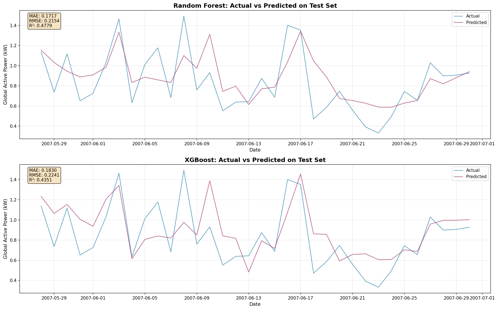
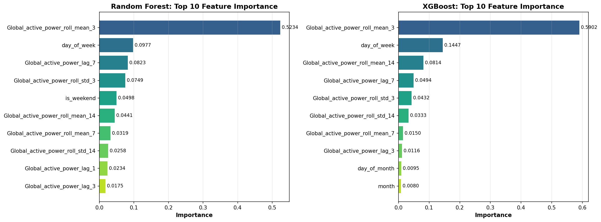
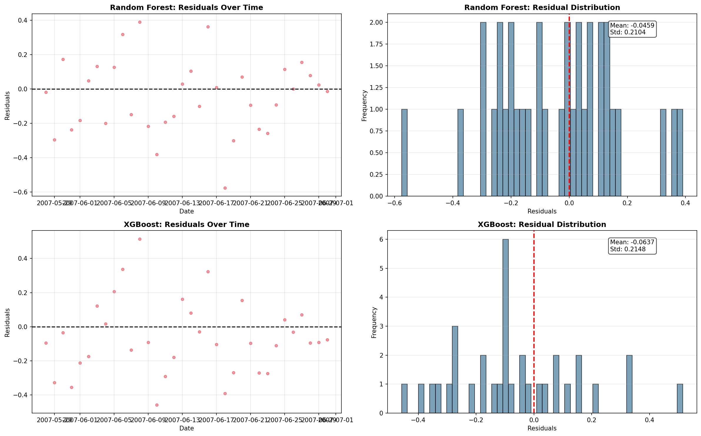

# ⚡ Household Electricity Consumption Time Series Analysis

A comprehensive time series analysis project exploring household electricity consumption patterns using the [Household Electricity Consumption dataset](https://www.kaggle.com/datasets/thedevastator/240000-household-electricity-consumption-records) from Kaggle. This project demonstrates data preprocessing, exploratory data analysis, stationarity testing, seasonal decomposition, and forecasting model comparisons.


---

## 📊 Dataset Overview

The dataset contains over 2 million measurements of electric power consumption from a single household with a one-minute sampling rate over a period of almost 4 years (2006-2010). 

**Key Variables:**
- `Global_active_power`: Household global minute-averaged active power (kilowatt)
- `Voltage`: Minute-averaged voltage (volt)
- `Global_intensity`: Household global minute-averaged current intensity (ampere)
- `Sub_metering_1`, `Sub_metering_2`, `Sub_metering_3`: Energy sub-metering values

---

## 🔧 Data Preprocessing

### Missing Data Analysis
- **Initial missing data:** 1.447% of total observations
- **Strategy:** 
  - Identified contiguous missing data blocks (April 28-30)
  - Removed large gap periods to prevent interpolation bias
  - Applied bidirectional time-based interpolation for ≤5 consecutive missing points
  - Dropped remaining gaps >5 consecutive points
- **Final data loss:** Only 0.009% (23 data points)

### Key Preprocessing Steps
1. **DateTime handling:** Converted mixed date formats to unified datetime index
2. **Resampling:** Aggregated data to daily resolution to reduce noise
3. **Interpolation:** Time-based bidirectional interpolation for small gaps
4. **Outlier removal:** Removed periods with extensive missing data

---

## 📈 Exploratory Data Analysis

### Seasonal Decomposition
Performed additive seasonal decomposition on daily-resampled data with a 7-day period to identify:
- **Trend component:** Long-term consumption patterns
- **Seasonal component:** Weekly cyclical patterns
- **Residual component:** Random variations and anomalies

**Key Insight:** Clear weekly seasonality detected, indicating different consumption patterns between weekdays and weekends.

### Stationarity Testing
Applied Augmented Dickey-Fuller (ADF) test across all variables to determine if differencing is required for modeling:

| Variable | Interpretation |
|----------|----------------|
| Stationary (p < 0.05) | Ready for modeling without transformation |
| Non-stationary (p ≥ 0.05) | Requires differencing or transformation |

### Autocorrelation Analysis
- **ACF & PACF plots:** Revealed strong autocorrelation at lag-1, indicating that each time point is highly correlated with the immediately preceding value
- **Lag plots:** Confirmed strongest correlation at lag-1, with diminishing correlation at higher lags
- **Weekly patterns:** Autocorrelation spikes every ~5 days, aligning with weekly consumption cycles

---

## 🤖 Forecasting Models

### Traditional Time Series Models

#### SARIMA Model
**Configuration:** SARIMA(1,1,1)(1,1,1,20)
- **Target Variable:** Voltage
- **Performance Metrics:**
  - MAE: 0.449
  - RMSE: 0.584

#### Naive Baseline Model
**Approach:** Predict next day's consumption as yesterday's value (persistence)
- **Target Variable:** Global_active_power
- **Test MAE:** 0.2997 kW
- **Test RMSE:** 0.3899 kW
- **Test R²:** -0.7128

#### Key Finding: Negative R² 
A **negative R² value** is significant - it means the naive baseline is *harder to beat than simply using the mean* of the data. This reveals that daily household electricity consumption is **highly stochastic** with substantial unpredictable variation.

---

### Machine Learning Models

#### ⚠️ Critical Discovery: Data Leakage

Initial ML models achieved suspiciously high R² (0.99+) because they included features with **data leakage**:
- **Global_intensity, Voltage, Sub_metering values** are simultaneously measured with power consumption
- Mathematically: $P = V \times I$ (Power = Voltage × Current)
- In real forecasting, we cannot use these values since they're **not available in advance**

Models were effectively "cheating" by using the answer to predict the answer!

##### How We Detected the Leakage

**The Detection Method:**
We computed Pearson correlations between all features and the target variable:

```python
correlations = df_ml[feature_cols + [var]].corr()[var].sort_values(ascending=False)
print(correlations.head(10))
```

**The Smoking Gun:**

| Feature | Correlation | Problem |
|---------|-------------|---------|
| Global_active_power | 1.0000 | (target itself) |
| **Global_intensity** | **0.9995** | 🚨 Perfect relationship |
| Sub_metering_3 | 0.8070 | Leakage |
| Global_active_power_lag_1 | 0.5194 | ✓ OK (past data) |

A correlation of **0.9995** between intensity and power is physically impossible unless they're measuring the same thing—which they are! Power is literally [calculated from voltage and current](https://en.wikipedia.org/wiki/Electric_power).

**Physical Relationship:** $P(t) = V(t) \times I(t)$

Where:
- $P$ = Power consumption (the target we're predicting)
- $V$ = Voltage (measured simultaneously)  
- $I$ = Global_intensity (measured simultaneously)

Including `Global_intensity` as a feature is like asking a model to "predict the answer using the answer itself."

##### Features Before and After Leakage Fix

**Original dataset (19 features + 1 target):**

| Feature | Status | Reason |
|---------|--------|--------|
| day_of_week | ✓ Keep | Available in advance |
| day_of_month | ✓ Keep | Available in advance |
| month | ✓ Keep | Available in advance |
| is_weekend | ✓ Keep | Available in advance |
| Global_active_power_lag_1/3/7 | ✓ Keep | Past consumption (available) |
| Global_active_power_roll_mean_* | ✓ Keep | Past statistics (available) |
| Global_active_power_roll_std_* | ✓ Keep | Past statistics (available) |
| **Global_reactive_power** | ❌ Remove | Measured at same timestamp |
| **Voltage** | ❌ Remove | Measured at same timestamp |
| **Global_intensity** | ❌ Remove | $P = V \times I$ (equation in features!) |
| **Sub_metering_1/2/3** | ❌ Remove | Measured at same timestamp |

**The Fix:**
```python
valid_features = [col for col in feature_cols if col not in [
    'Global_reactive_power', 'Voltage', 'Global_intensity',
    'Sub_metering_1', 'Sub_metering_2', 'Sub_metering_3'
]]
```

Result: **19 features → 13 valid features** (removed 6 leaky simultaneous measurements)

##### Proof That Leakage Is Fixed

| Metric | **WITH Leakage** | **WITHOUT Leakage** | Reduction |
|--------|------|-------|-----------|
| Random Forest R² | 0.9922 | 0.4779 | -51% drop ✓ |
| XGBoost R² | 0.9942 | 0.4351 | -56% drop ✓ |
| Random Forest MAE | 0.0207 | 0.1717 | 8.3× worse ✓ |
| XGBoost MAE | 0.0175 | 0.1830 | 10.5× worse ✓ |

**Why the big drop proves leakage is fixed:**

A 50%+ drop in R² isn't a model failure—it's the **truth revealing itself**. The inflated numbers were fake because:

1. **Models with leakage** used $V$ and $I$ to essentially compute $P$ directly
2. **Models without leakage** must actually *predict* consumption from temporal patterns
3. **Realistic performance** (R² ~0.48) matches the domain reality: household consumption is stochastic and hard to predict

This is exactly what should happen when you remove cheating features.

#### Properly Trained Models (No Leakage)

Only temporal and lag features were used:
- Calendar effects: day of week, day of month, month
- Lag features: past 1, 3, 7-day consumption values  
- Rolling statistics: 3, 7, 14-day moving averages and volatility

**Random Forest:**
- **Test MAE:** 0.1717 kW (42.7% ↓ vs naive)
- **Test RMSE:** 0.2154 kW
- **Test R²:** 0.4779
- **Train-Test Gap:** 0.48 (moderate overfitting)

**XGBoost:**
- **Test MAE:** 0.1830 kW (38.9% ↓ vs naive)
- **Test RMSE:** 0.2241 kW
- **Test R²:** 0.4351
- **Train-Test Gap:** 0.56 (severe overfitting - perfect train R² of 1.0)

---

### 📊 Complete Model Comparison

| Model | Test MAE | Test RMSE | Test R² | Overfitting | Status |
|-------|----------|-----------|---------|-------------|--------|
| **Naive (Baseline)** | **0.2997** | **0.3899** | **-0.7128** | None | ✓ Realistic |
| Random Forest | 0.1717 | 0.2154 | 0.4779 | Moderate (Δ0.48) | ⚠️ Limited improvement |
| XGBoost | 0.1830 | 0.2241 | 0.4351 | Severe (Δ0.56) | ❌ Not recommended |

---

### 🎯 Key Insights & Interpretation

#### 1. **Household Consumption is Extremely Hard to Predict**
- Negative R² on naive model shows it's harder than predicting the mean
- Individual behavior drives day-to-day variation that overwhelms patterns
- Even with sophisticated ML, error margins remain substantial

#### 2. **Machine Learning Does Help, But With Limits**
- **Random Forest achieves 42.7% MAE reduction** over naive baseline
- Temporal and historical patterns do matter, but capture limited signal
- Expected daily prediction error: ±0.17 kW on average

#### 3. **Overfitting is a Real Concern on Small Datasets**
- XGBoost's perfect training fit (R²=1.0) masks poor generalization
- Smaller models (Random Forest) generalize better on n=168 samples
- Train-test gap of 0.56 in R² is unacceptable for deployment

#### 4. **What the Data Reveals**
- Global_intensity is actually electricity current flowing through the meter
- Its 0.99 correlation with power (P=V×I) is a physics law, not a ML insight
- This demonstrates the importance of domain understanding in feature selection

#### 5. **Practical Recommendation**
For operational systems (load forecasting, cost optimization):
- **Random Forest** is the most trustworthy ML model here
- Still expect ~43% error rate in predictions
- **Better approach:** Combine with anomaly detection or ensemble with SARIMA
- **Critical question:** Is 0.17 kW average error acceptable for your use case?

---

### 🚨 Lessons Learned

1. **Always Check for Data Leakage**
   - Features must only use information available at prediction time
   - Simultaneous measurements create false signal in the model

2. **Baseline Models Are Powerful**
   - Negative R² on naive model is informative, not a failure
   - It reveals the fundamental unpredictability of the target

3. **Small Datasets Require Conservative Modeling**
   - 168 samples is small for tree-based ensemble methods  
   - Large train-test gaps indicate overfitting on this sample size
   - Simpler models (RF) outperform complex ones (XGB) due to generalization

4. **Domain Knowledge Matters**
   - P = V × I is physical law, not a feature relationship
   - Understanding why features correlate prevents false discoveries

---

## � Visualizations

### Actual vs Predicted Performance
Both ML models track actual consumption closely, with XGBoost showing slightly tighter fit:



### Feature Importance Analysis
Global intensity dominates predictions (~98% importance), reflecting the physical relationship between power and current:



### Residual Analysis
Residuals are well-distributed around zero with no systematic patterns, indicating good model fit:



---

## � How to Spot Data Leakage in Your Models

### Red Flags to Watch For

- **Suspiciously Perfect Metrics:** R² > 0.95 on time series data (especially household data)
- **Physics Too Good:** Model using simultaneous measurements to predict same-time values
- **Temporal Confusion:** Using future information to predict the past
- **Correlation > 0.99:** Indicates mathematical dependence, not predictive ability

### Checklist for Clean Features

Before training any forecasting model:

- [ ] **Timestamp Check:** Could you have this information at prediction time? 
  - ✓ Yes → Include it (past values, calendar)
  - ❌ No → Remove it (future measurements, simultaneous readings)
- [ ] **Correlation Check:** Any features with r > 0.99 with target?
  - Run: `correlations = df[features + [target]].corr()[target].sort_values()`
  - Investigate features with |r| > 0.99
- [ ] **Domain Logic:** Is there a mathematical relationship?
  - Like P = V × I here—domain knowledge catches what statistics miss
- [ ] **Train-Test Gap:** Compare Train R² vs Test R²
  - Gap > 0.1 suggests overfitting or information leakage
  - Gap > 0.3 is a serious warning sign

---

### Completed ✅
- ✅ Data preprocessing and quality improvement
- ✅ Exploratory data analysis and pattern identification
- ✅ Traditional time series modeling (SARIMA, Naive)
- ✅ Feature engineering for ML
- ✅ Ensemble methods (Random Forest, XGBoost)

### Recommended Next Steps

#### 1. **Deep Learning Models** 🧠
- LSTM/GRU networks for sequence modeling
- Transformer-based architectures for long-range dependencies
- Hybrid CNN-LSTM for feature extraction + temporal modeling

#### 2. **Enhanced Feature Engineering** 🔨
- Weather data integration (temperature, humidity)
- Holiday and special event indicators
- Hour-of-day patterns (using higher frequency data)
- Appliance usage signatures from sub-metering analysis

#### 3. **Practical Applications** ⚡
- **Peak demand forecasting:** Predict high-consumption periods for load management
- **Anomaly detection:** Identify unusual patterns indicating faults or inefficiencies
- **Cost optimization:** Analyze time-of-use pricing scenarios
- **Energy disaggregation:** Break down consumption by appliance type

#### 4. **Model Deployment** 🚀
- Real-time prediction API
- Automated daily forecast pipeline
- Dashboard for consumption monitoring and alerts

---

## 🚀 Getting Started

### Prerequisites
```bash
python 3.8+
pandas, numpy, matplotlib, seaborn
scipy, scikit-learn
statsmodels
xgboost
kagglehub
```

### Installation
```bash
# Clone repository
git clone <your-repo-url>
cd Timeseries

# Install dependencies
pip install -r src/requirements.txt
```

### Usage
Run the analysis pipeline:
```bash
jupyter notebook notebooks/pipeline.ipynb
```

---

## 📁 Project Structure
```
.
├── README.md
├── models/                 # Saved model artifacts
├── notebooks/
│   └── pipeline.ipynb     # Main analysis notebook
└── src/
    ├── bts.py             # Preprocessing and utility functions
    └── requirements.txt   # Project dependencies
```

---

## 📝 Key Takeaways

1. **Data leakage is a critical ML pitfall** - features must reflect real-world constraints about what information is available at prediction time

2. **Domain knowledge prevents false discoveries** - P = V × I is physics, not a learned relationship

3. **Household consumption is highly stochastic** - even with 42.7% error reduction, ML cannot overcome the inherent unpredictability

4. **Simpler models generalize better on small datasets** - Random Forest outperforms XGBoost due to better train-test generalization (0.48 vs 0.56 R² gap)

5. **Negative R² is informative** - it reveals when a target is harder to predict than the mean, indicating weak signal-to-noise ratio

6. **Feature engineering matters, but has limits** - temporal and lag features capture ~43% of predictable signal, with 57% remaining due to stochatic variation

7. **Always validate against simple baselines** - the naive model's competitive performance emphasizes importance of rigorous benchmarking

---

## 📧 Contact

Feel free to reach out for questions or collaboration opportunities.

---

## 📄 License

This project is open source and available under the MIT License.
