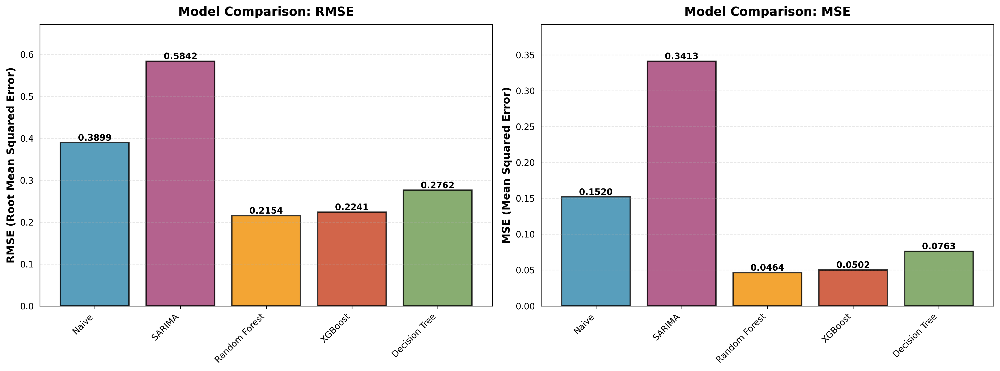

# Household Electricity Consumption — Time Series Analysis

This is a project where I tried to predict how much electricity a household uses per day, using [this Kaggle dataset](https://www.kaggle.com/datasets/thedevastator/240000-household-electricity-consumption-records) — about 2 million minute-by-minute readings from one house, from 2006 to 2010.

## Cleaning the data

First thing I did was clean the data. About 1.4% of it was missing. Some of it was one big missing chunk (April 28-30), so I just dropped that. Small gaps (5 points or less) I filled in by interpolating. Ended up only losing 0.009% of the data overall, which is basically nothing. Then I resampled everything down to daily numbers instead of minute-by-minute, since minute data is way too noisy to work with directly.

Key variables in the raw data:
- `Global_active_power`: minute-averaged active power (kW) — this is the thing I'm trying to predict, daily
- `Voltage`, `Global_intensity`: voltage and current, measured minute-by-minute
- `Sub_metering_1/2/3`: sub-metered energy for specific circuits (kitchen, laundry, water heater/AC)

## Looking for patterns

Once that was done I looked at the patterns. There's a clear weekly cycle, people use power differently on weekends vs weekdays, which showed up clearly in a seasonal decomposition (7-day period). ADF tests told me which variables were stationary and which needed differencing before modeling.

There's also a strong "yesterday predicts today" pattern (autocorrelation at lag 1), plus a weaker echo every ~5 days that lines up with the weekly cycle. Lag plots backed this up; correlation is strongest at lag-1 and fades out after that.

## Forecasting

For the actual forecasting, I started with a dumb baseline: just guess that tomorrow will be the same as today (persistence). That got a **Test R² of -0.7128** (MAE 0.2997 kW, RMSE 0.3899 kW), which sounds bad, but it's actually useful info; a negative R² means even just guessing the average would beat this. It tells you the data is genuinely noisy and hard to predict.

Then I tried SARIMA(1,1,1)(1,1,1,20) on voltage and got MAE 0.449 / RMSE 0.584 — a modest result, nothing dramatic.

### The data leakage trap

After that I moved to Random Forest and XGBoost. First time I ran those, they scored **R² of 0.99+**, which should've been a red flag right away; nothing about daily power usage should be that predictable. Turns out I had data leakage: some of the features I was using (voltage, current, the sub-metering columns) are all measured at the exact same time as the thing I was trying to predict. And since power = voltage × current ($P = V \times I$), giving the model the current is basically giving it the answer. It wasn't predicting anything, it was just doing multiplication.

The tell was in the correlations - `Global_intensity` had a 0.9995 correlation with the target. A correlation that close to 1 between two physically-linked measurements means you're not looking at a prediction, you're looking at arithmetic.

So I dropped all six of those leaky columns (`Global_reactive_power`, `Voltage`, `Global_intensity`, `Sub_metering_1/2/3`) and only kept stuff you'd actually know ahead of time — day of the week, day of the month, month, whether it's a weekend, past values (1, 3, 7 days back), and rolling averages/std at 3/7/14 days. 13 features in total.

Once I did that, the scores dropped back down to something realistic. That's expected, the model went from "cheating" to actually trying to find real patterns. I also threw a plain Decision Tree into the mix on the same clean features, mostly as a sanity check against the ensembles.

## Results

| Model | Test MAE | Test RMSE | Test R² | Notes |
|-------|----------|-----------|---------|-------|
| Naive (persistence) | 0.2997 | 0.3899 | -0.7128 | Honest baseline |
| SARIMA | 0.4491 | 0.5842 | – | On voltage, not power |
| Decision Tree | 0.1896 | 0.2762 | – | Sanity check, no leakage |
| Random Forest | 0.1717 | 0.2154 | 0.4779 | Train R² 0.96 → some overfitting |
| XGBoost | 0.1830 | 0.2241 | 0.4351 | Train R² 1.00 → overfits badly |

Comparing everything at the end: the naive baseline had MAE 0.30, Random Forest got that down to 0.17 (about 43% better), and XGBoost was close behind at 0.18 but overfit pretty badly - its training R² was a perfect 1.0, which never happens on real data. Random Forest handled the small dataset (only 168 daily samples) much better.

## What I took away from this

- Household electricity use is mostly just noisy human behavior, and even a decent model only explains about half of it.
- If your R² looks suspiciously perfect, check for leakage before celebrating, anything with a correlation above 0.99 to your target is probably measuring the same thing, not predicting it.
- On small datasets, simpler models tend to win because complex ones overfit (168 samples is not a lot for a tree ensemble).
- Negative R² isn't a bug; it's a signal that the target is genuinely close to unpredictable given what you fed the model.

## Visualizations

### Model comparison: RMSE & MSE
Naive, SARIMA, Decision Tree, Random Forest, and XGBoost side by side:



### Actual vs predicted
Random Forest and XGBoost predictions vs actual daily consumption on the test set:


### Feature importance
Top 10 features driving each model's predictions:


### Residuals
Both models' residuals cluster loosely around zero with similar spread (std ~0.21), but XGBoost skews slightly more negative on average (mean -0.06 vs -0.05 for Random Forest) — a mild sign it's over-predicting a bit more often:


---

## Spotting leakage like this in future

Some things I'd check earlier next time:
- R² > 0.95 on a noisy real-world target is a reason to be suspicious, not happy
- Any feature with |correlation| > 0.99 to the target;  check if it's measured at the same time as the target, or mathematically derived from it
- Compare train R² vs test R². A gap over ~0.3 usually means overfitting or leakage, not a good model

## If I kept going with this

I'd want to try an LSTM or small transformer, throw in weather data, and maybe build toward something useful like flagging unusually high usage days. Other stuff on the list: hour-of-day patterns from higher-frequency data, holiday indicators, and actually deploying this as a daily forecast job instead of a notebook.

## To run it

```bash
git clone <repo-url>
cd Timeseries
pip install -r src/requirements.txt
jupyter notebook notebooks/pipeline.ipynb
```

Needs Python 3.8+, plus pandas, numpy, matplotlib, seaborn, scipy, scikit-learn, statsmodels, xgboost, kagglehub (all in `src/requirements.txt`).

## Project structure

```
.
├── README.md
├── models/                # Saved model artifacts
├── notebooks/
│   └── pipeline.ipynb     # Main analysis notebook
└── src/
    ├── bts.py             # Preprocessing and utility functions
    └── requirements.txt   # Project dependencies
```

